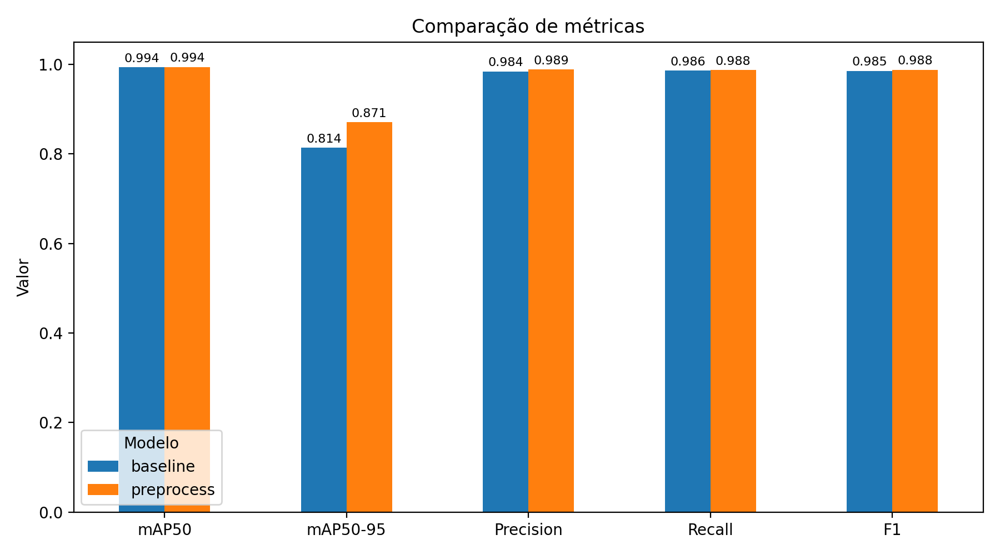
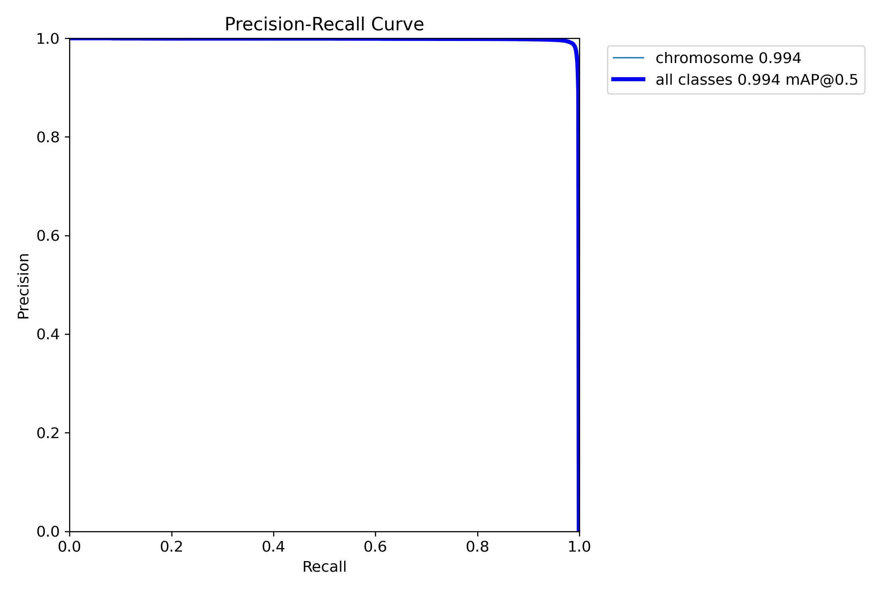
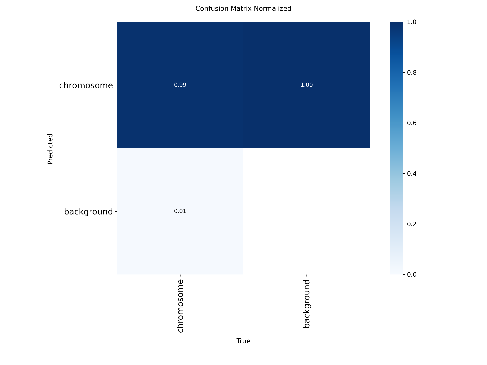

# Benchmark: Baseline vs Preprocess

Comparação entre dois modelos YOLO26m treinados para detecção de cromossomos em micrografias:
um treinado no **dataset original** (baseline) e outro treinado no **dataset pré-processado** (preprocess).

## Modelos comparados

| Modelo | Treinado em | Arquitetura | Épocas | Pesos |
|---|---|---|---|---|
| `baseline` | Dataset original (sem pré-processamento) | YOLO26m | 125 | `models/yolo26m-original/model/best.pt` |
| `preprocess` | Dataset pré-processado | YOLO26m | 125 | `models/yolo26m-preprocessed/model/best.pt` |

Os pesos ficam versionados no Hugging Face ([irlvinicius/KaryoVisio](https://huggingface.co/irlvinicius/KaryoVisio)) e são baixados automaticamente pelo notebook (ficam em cache local).

O dataset de origem é o descrito em [A large-scale dataset of chromosome images for machine learning applications](https://www.nature.com/articles/s41597-023-02003-7) (Scientific Data, 2023).

## Protocolo de avaliação

Para a comparação ser justa, os dois modelos foram avaliados com **exatamente as mesmas condições**:

| Item | Valor |
|---|---|
| Dataset de avaliação | `data/processed/24_chromosomes_object` (versão pré-processada), definido em [`../_shared/dataset.yaml`](../_shared/dataset.yaml) |
| Split | `test` <!-- TODO: confirmar (test ou val) --> |
| `imgsz` | 640 <!-- TODO: confirmar com o treino --> |
| `conf` | 0.001 |
| `iou` (NMS) | 0.7 |
| `batch` | 16 |
| `seed` | 0 |

Os parâmetros ficam em [`../_shared/eval_config.yaml`](../_shared/eval_config.yaml) e a lógica de avaliação em [`../_shared/utils.py`](../_shared/utils.py), compartilhados por todas as comparações do `benchmark/`.

> ⚠️ **Ponto de atenção:** o baseline foi treinado em imagens originais, mas nesta rodada é avaliado nas imagens pré-processadas. Isso pode penalizá-lo, pois ele vê um tipo de imagem diferente do que aprendeu. Se o preprocess ganhar, parte da vantagem pode vir do "terreno" de avaliação. Uma segunda rodada, avaliando ambos no dataset original, está planejada.

## Resultados

<!-- TODO: colar aqui o conteúdo de results/metrics_table.md depois de rodar o notebook -->

| Modelo     |   mAP50 |   mAP50-95 |   Precision |   Recall |     F1 |   Inferência (ms/img) |
|:-----------|--------:|-----------:|------------:|---------:|-------:|----------------------:|
| baseline   |  0.9935 |     0.8137 |      0.9841 |   0.9861 | 0.9851 |               175.658 |
| preprocess |  0.9938 |     0.8709 |      0.9885 |   0.9875 | 0.988  |               181.211 |



### Curvas Precision-Recall

| Baseline | Preprocess |
|---|---|
|  |  |

### Matrizes de confusão (normalizadas)

| Baseline | Preprocess |
|---|---|
|  |  |

## Conclusão

<!-- TODO: preencher após rodar. Sugestão de estrutura:
- Qual modelo foi melhor e em quais métricas (citar a diferença em pontos).
- Se a diferença é grande ou pequena na prática.
- Se há trade-off (ex.: precision subiu, recall caiu).
- Relembrar o ponto de atenção acima ao interpretar o resultado. -->

## Como reproduzir

1. Garanta que o dataset está em `data/processed/24_chromosomes_object` (relativo à raiz do repositório). Se estiver em outro lugar, defina a variável de ambiente:
   ```bash
   export KARYO_DATA_ROOT=/caminho/para/24_chromosomes_object
   ```
2. Instale as dependências:
   ```bash
   pip install ultralytics huggingface_hub pandas matplotlib tabulate pyyaml
   ```
3. Abra e execute [`baseline_vs_preprocess.ipynb`](baseline_vs_preprocess.ipynb) (o kernel precisa ter sido iniciado a partir desta pasta, pois o notebook usa caminhos relativos).

Na primeira execução o notebook baixa os pesos do Hugging Face e roda a validação. O resultado é salvo em `results/metrics_table.csv` e reaproveitado nas execuções seguintes. Para reavaliar do zero, use `FORCE_REEVAL = True` ou apague o CSV.

## Estrutura da pasta

```
benchmark/
├── _shared/
│   ├── utils.py               # download dos pesos, avaliação e gráficos
│   ├── dataset.yaml           # dataset usado na avaliação
│   └── eval_config.yaml       # parâmetros de avaliação (conf, iou, imgsz...)
└── baseline_vs_preprocess/
    ├── README.md              # este arquivo
    ├── baseline_vs_preprocess.ipynb
    └── results/
        ├── metrics_table.csv  # métricas em formato reaproveitável
        ├── metrics_table.md
        ├── metrics_comparison.png
        ├── baseline/          # curvas e matriz de confusão do baseline
        └── preprocess/        # curvas e matriz de confusão do preprocess
```